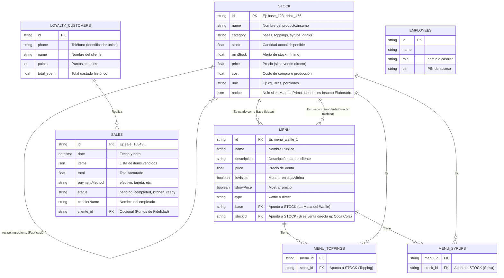

# Diagrama de Entidad-Relación (BD Sr. Waffle)

Aquí tienes el diagrama de la base de datos para comprender la relación entre Stock, Recetas, Menú y Ventas. 

### Explicación del Flujo de Inventario (Opción B)
1. **La Tabla Central es `STOCK`:** Aquí viven todos los elementos físicos que tienes en tu negocio. 
   - Una "Lata de Coca Cola" es un item en `STOCK`.
   - "Un Kilo de Harina" es un item en `STOCK`.
   - "Una Porción de Masa" también es un item en `STOCK`.
2. **El Sistema de Recetas (Insumos Elaborados):** Si un item de `STOCK` tiene el campo interno `recipe` lleno (ej. "Masa Tradicional" rinde 20 porciones y gasta 1kg harina + 5 huevos), el sistema sabe que es un Insumo Elaborado. Cuando le das al botón de "Fabricar", lee esa receta y altera la misma tabla de `STOCK` (Suma 20 Masas, Resta Harina y Huevos).
3. **El Menú Público (`MENU`):** Un Waffle en tu menú no es un elemento físico en tu stock, es un "Ensamblaje virtual". El registro del Waffle en la base de datos simplemente apunta a IDs de la tabla `STOCK` (Apunta a un ID de Masa, un ID de Topping, etc). Cuando se vende el Waffle, el sistema descuenta 1 unidad de cada uno de los items a los que apunta.
4. **Venta Directa:** Si agregas una Bebida y le pones Precio de Venta, el sistema automáticamente crea un registro en `MENU` que apunta 1 a 1 a ese ID de `STOCK`, para que aparezca en la caja registradora.
