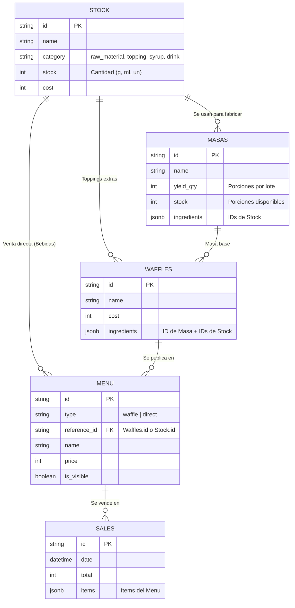

# Diagrama Entidad-Relación (Base de Datos) - Sr. Waffle V2

A continuación se detalla la estructura y el modelo relacional de la base de datos de "Sr. Waffle", ahora rediseñada bajo un esquema estricto de control de inventario y recetas.

El sistema funciona con soporte local (JSON) y soporte PostgreSQL (para la versión Dockerizada).

## Diagrama Visual (ERD)



## Esquema Relacional Estricto

### 1. `STOCK` (Inventario y Materias Primas)
Almacena todos los productos comprados a proveedores. Representa el nivel más bajo del inventario físico.
```json
{
  "id": "raw_material_1718100000",
  "name": "Harina 0000",
  "category": "raw_material", // Enum: raw_material, topping, syrup, drink, icecream
  "stock": 15000,             // Cantidad total (Ej: 15000 gramos)
  "minStock": 2000,           // Alerta de stock mínimo
  "unit": "g",                // Unidad de medida (g, ml, unidades)
  "cost": 1500,               // Costo Interno (Total / Unidades de Pack)
  "portion_size": 0,          // Gramos/ML utilizados cuando se vende como "Porción Extra"
  "price_per_portion": 0      // Precio de venta cuando se vende como "Porción Extra"
}
```

### 2. `MASAS` (Insumos Elaborados)
Almacena productos que la cocina fabrica internamente consumiendo materias primas de la tabla `STOCK`.
```json
{
  "id": "masa_1718200000",
  "name": "Masa Tradicional Dulce",
  "yield_qty": 20,            // Cuántas porciones de masa rinde 1 lote fabricado
  "cost": 120,                // Costo calculado (Suma Costo Ingredientes / yield_qty)
  "stock": 40,                // Stock de masas disponibles
  "ingredients": [
    {
      "type": "stock",
      "id": "raw_material_1718100000",
      "qty": 1000             // Requiere 1000g de harina por lote
    }
  ]
}
```

### 3. `WAFFLES` (Recetas Finales)
Almacena el catálogo de recetas de Waffles (Fichas Técnicas). No tienen precio ni visibilidad pública.
```json
{
  "id": "waffle_1718300000",
  "name": "Delicia Frutal",
  "description": "Waffle dulce con frutillas",
  "cost": 620,                // Costo calculado (Masa + Ingredientes)
  "ingredients": [
    {
      "type": "masa",
      "id": "masa_1718200000", // Consume 1 masa base
      "qty": 1
    },
    {
      "type": "stock",
      "id": "topping_1718400000", // Consume N gramos de frutilla (según portion_size del stock)
      "qty": 30
    }
  ]
}
```

### 4. `MENU` (Vitrina Pública)
Almacena los productos que el cliente final puede comprar en la caja. Pueden ser Waffles (referenciando a la tabla `WAFFLES`) o Venta Directa (referenciando a la tabla `STOCK`).
```json
{
  "id": "menu_1718500000",
  "type": "waffle",           // "waffle" o "direct"
  "reference_id": "waffle_1718300000", // ID de la receta o stock asociado
  "name": "Waffle Delicia Frutal",
  "price": 5500,              // Precio final al público
  "is_visible": true          // Visible en el catálogo POS
}
```

### 5. `SALES` (Historial de Ventas)
Registra cada transacción completada en el POS.
```json
{
  "id": "sale_1718700000",
  "date": "2026-06-16T15:30:00Z",
  "total": 7300,
  "paymentMethod": "Efectivo",
  "cashierName": "Juan Perez",
  "status": "completed",
  "items": [
    {
      "id": "waffle_1718300000",
      "type": "menu_waffle",
      "name": "Delicia Frutal",
      "price": 5500,
      "config": {} // Detalles de personalización si existieron
    }
  ]
}
```

## Relación de Flujo de Datos
1. **Compras:** Proveedor -> `STOCK` (Almacena Gramos, Mililitros, Unidades).
2. **Producción:** Cocina hace un Lote -> Descuenta Gramos de `STOCK` -> Suma Unidades a `MASAS`.
3. **Ventas (Menú Público):** Caja vende Producto del Menú -> 
   - Si es "waffle": Descuenta 1 Unidad de `MASAS` + Descuenta X gramos exactos de `STOCK` (según receta de `WAFFLES`).
   - Si es "direct": Descuenta 1 Unidad directa de `STOCK`.
   - Si el cliente añade "Extras": Descuenta *Tamaño de Porción* del `STOCK`.
