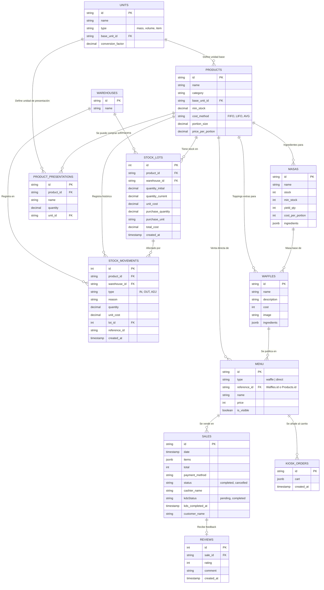

# Diagrama Entidad-Relación (Base de Datos) - Sr. Waffle V2

A continuación se detalla la estructura y el modelo relacional de la base de datos de "Sr. Waffle". El sistema ha sido migrado a un esquema avanzado de tipo ERP para la gestión de inventario, incluyendo manejo de unidades, lotes, movimientos históricos de almacén y módulos de Kiosco/Cocina.

El sistema funciona nativamente con PostgreSQL. (Aún conserva un fallback a JSON local para desarrollo, pero la estructura primaria se define en SQL).

## Diagrama Visual (ERD)

## Esquema Relacional ERP

### 1. Sistema de Unidades y Presentaciones
- **`UNITS`**: Define las magnitudes de medida base (gramos, mililitros, unidades) y sus conversiones (ej. 1 kg = 1000g).
- **`PRODUCT_PRESENTATIONS`**: Permite definir cómo se compra un producto al proveedor (ej. "Bolsa de 25KG de Harina").

### 2. Inventario Avanzado (Método FIFO)
- **`PRODUCTS`**: Tabla maestra de artículos (antes STOCK). Posee categoría, alertas de stock mínimo, tamaño de porción de venta, precio de venta directo y método de costeo.
- **`WAREHOUSES`**: Define depósitos lógicos (ej. "Depósito Principal").
- **`STOCK_LOTS`**: Cada compra ingresa como un lote individual (`Lote`). Registra costo unitario de ese momento histórico, permitiendo costeo real (FIFO).
- **`STOCK_MOVEMENTS`**: Histórico inmutable. Cualquier adición, resta o ajuste de inventario queda registrado aquí, afectando a un lote específico.

### 3. Producción Interna
- **`MASAS`**: Insumos elaborados internamente. Consume cantidades en base a las unidades de los `PRODUCTS` y se almacena en porciones. Posee `min_stock` para control de producción.
- **`WAFFLES`**: Fichas técnicas (Recetas). Combina una porción de `MASAS` más toppings adicionales (cantidades descontadas de `PRODUCTS`).

### 4. Ventas y Módulos Externos
- **`MENU`**: Vitrina comercial. Determina qué se visualiza en la terminal POS, Kiosco y `/app`.
- **`KIOSK_ORDERS`**: Almacena temporalmente los pedidos autogestionados por clientes hasta que son pagados en caja.
- **`SALES`**: Centraliza la facturación. Posee integración directa con el KDS (Cocina) a través de `kdsStatus` y `kds_completed_at`.
- **`REVIEWS`**: Retroalimentación conectada a la venta, ingresada por el cliente post-consumo.

## Flujo de Datos Transaccional
1. **Compras:** Al ingresar una presentación comercial, el sistema desglosa los gramos/ml, crea un nuevo `STOCK_LOTS` (Lote) y graba el ingreso en `STOCK_MOVEMENTS`.
2. **Fabricación:** Al producir `MASAS`, se generan movimientos de salida (`OUT`) en `STOCK_MOVEMENTS` por cada ingrediente utilizado (descontando del lote más viejo si es FIFO), y aumenta el `stock` de la masa.
3. **Kiosco:** Genera un pre-ticket en `KIOSK_ORDERS`. No descuenta stock físico.
4. **Caja (POS):** Factura el pedido (o aprueba un pedido de Kiosco). Genera un `SALES`. Inmediatamente genera una petición de salida de insumos (para lo que sea directo o waffle).
5. **Cocina (KDS):** Visualiza los ítems pendientes usando el `kdsStatus`. Al marcar como terminado, se actualiza `kds_completed_at`.
