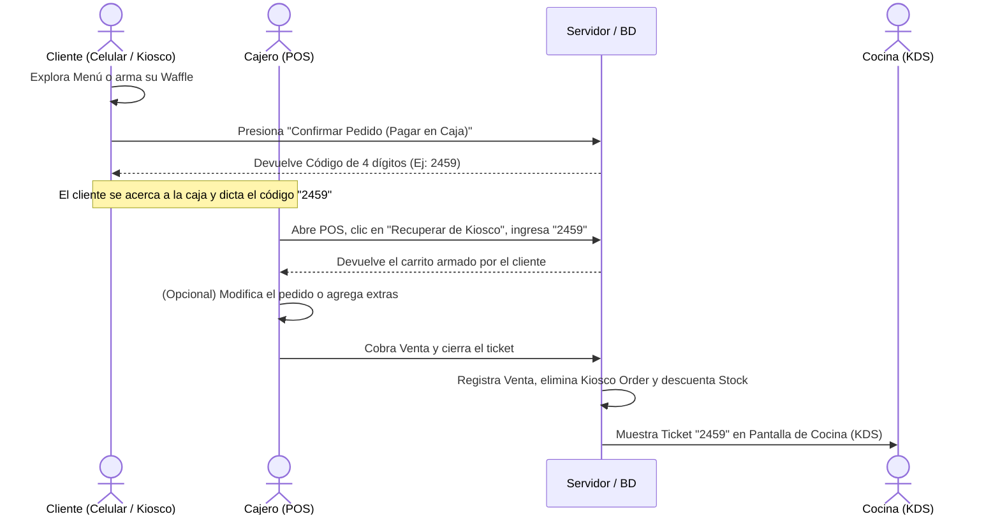
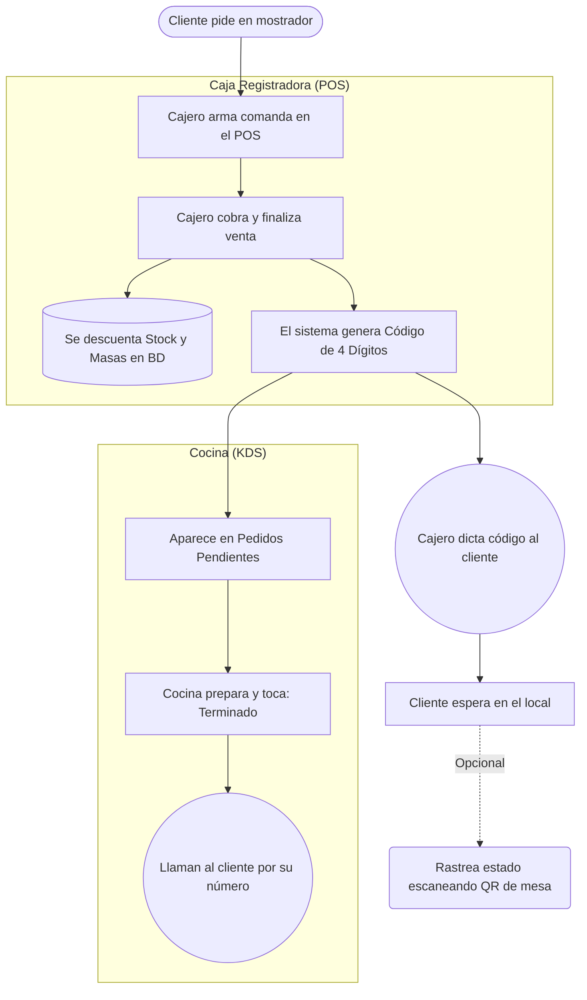
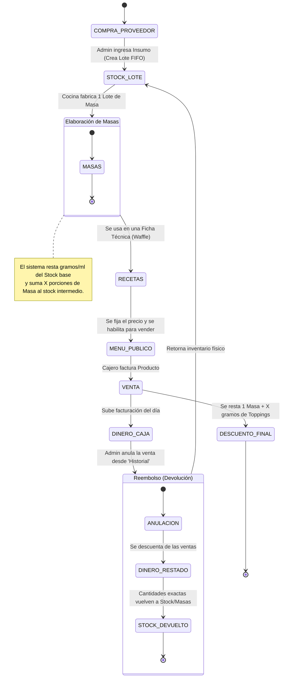
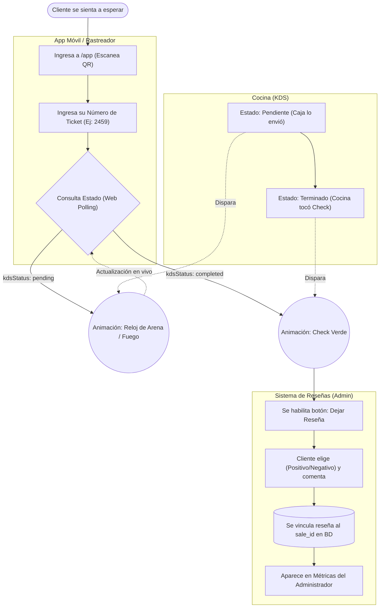

# Diagramas de Flujo del Sistema - Sr. Waffle

Este documento ilustra los flujos de trabajo principales de la aplicación a través de diagramas visuales (Mermaid). 
El sistema soporta múltiples circuitos de ventas que convergen en el mismo embudo de facturación (POS), producción (Cocina / KDS) y post-venta (Rastreo y Reseñas).

---

## 1. Circuito A: Autopedido (Menú Público / Kiosco)

Este es el camino que sigue un cliente que arma su pedido desde su celular (Menú Público) o desde una tablet física en el local (Kiosco). El proceso genera un pre-ticket en la base de datos sin descontar stock físico hasta que es facturado en caja.

*(Nota: Opcionalmente, desde el menú público web, el cliente podría enviar su pedido por WhatsApp si el administrador tiene habilitada esta opción en configuraciones).*

---

## 2. Circuito B: Venta Presencial Asistida (Mostrador)

El camino clásico donde el cliente ingresa al local y el empleado toma su pedido directamente desde la caja registradora.

---

## 3. Circuito C: Gestión de Inventario y Producción (Admin)

Este diagrama muestra cómo el administrador gestiona la cadena de suministro, desde la compra bruta hasta el producto final y cómo se revierten operaciones ante errores (Reembolsos).

---

## 4. Circuito D: Rastreo, Módulo Móvil y Reseñas

Este circuito explica qué pasa desde que el cliente obtiene su ticket pagado hasta que deja una reseña post-consumo en la aplicación `/app`.

